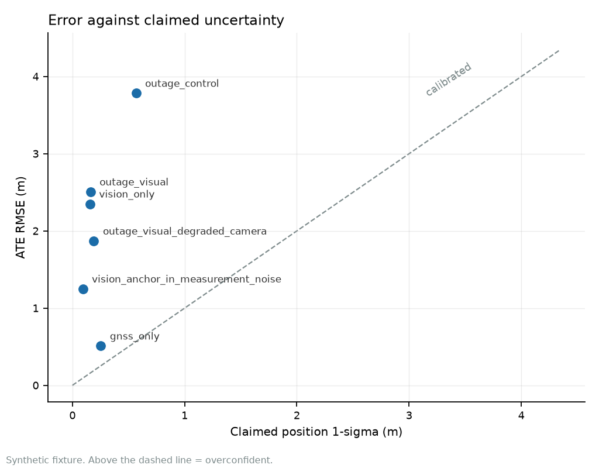
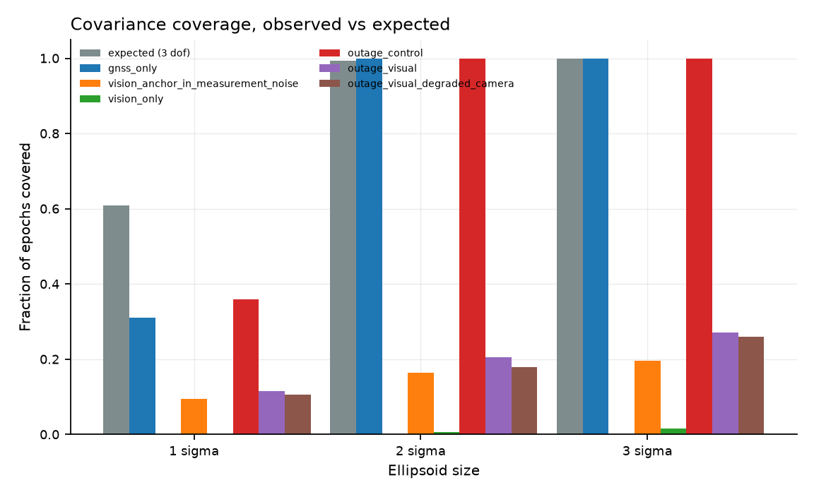
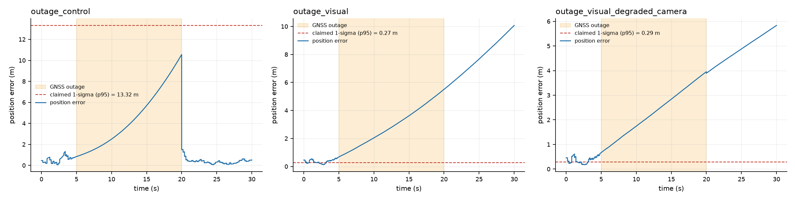
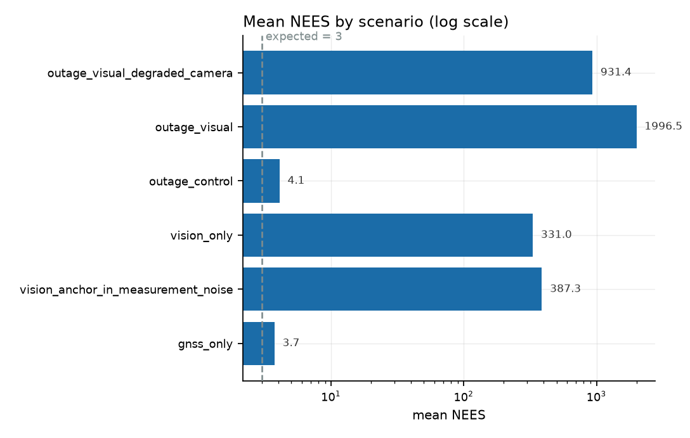

# contested-nav

Replay, evaluation and uncertainty calibration for GNSS-denied navigation.

[](https://github.com/Telschow/contested-nav/actions/workflows/ci.yml)
[](https://github.com/Telschow/contested-nav/actions/workflows/pages.yml)
[](LICENSE)
[](tests)
[](CONSTRAINTS.md)

A 21-state error-state Kalman filter for fused GNSS and visual navigation, built
around one commitment: **a filter that reports its uncertainty should be
correct about that uncertainty.** Where it is not, this repository says so with
a measurement rather than a caveat.

> **All results in this repository are synthetic.** They come from a
> known-answer fixture: an analytic trajectory with the filter initialised
> exactly at the truth. No real sensor capture is vendored or evaluated, and no
> number here is a field measurement. See [Status](#status-and-limits).

## The result that motivated this

With GNSS denied for 15 s and visual odometry enabled, the filter reports
**0.161 m** of position uncertainty while being **2.54 m** wrong. Mean NEES is
**419.4** against an expected 3, and only 20.0% of epochs fall inside the
2σ ellipsoid where 99.2% should.

Those are one draw, and the draw is not the point. Two sweeps test whether the
finding is an artefact of that particular fixture.

**10 independent noise realisations** of the same trajectory, holding geometry
fixed (`scripts/seed_sweep.py --seeds 10`): `outage_visual` is overconfident at
**every** seed, mean NEES 844, range 211.7 to 2103.4, coverage 6.8% to 34.8%.

**8 scenes** with the trajectory geometry varied — path length spans 17.3 m to
80.6 m, a 4.65x range — holding duration, sample rate and the exact `t=0`
initial state fixed (`scripts/scene_sweep.py`): **all seven case verdicts are
identical in all eight scenes**, and `outage_visual` gives mean NEES
**419.7 [414.4, 424.9]** at **20.0%** coverage. Every case reports a stable
verdict, so the ordering in the results table is not an accident of one path.

So the failure is a property of the design rather than of a lucky fixture. The
exact digits are not, and are quoted here as one sample of a wide distribution.
Confident intervals are deterministic percentile bootstrap, 10 000 resamples,
fixed RNG seed, so two runs of a sweep cannot disagree.

This is not a tuning problem and it is not a crash. The filter runs, converges,
and produces confident nonsense. It is therefore shipped with
`vision_enabled=False` by default, and the failure is documented rather than
hidden. [Why it happens](#the-one-thing-this-cannot-do) is below.

Adaptive covariance inflation (ADR-0006) has since recovered part of this case —
ATE 5.059 m to 2.541 m, rejections 51 to 5 — but the remaining NEES gap is
unresolved, so the honesty requirement above stands.

## Install

No install step is required to run the tests or the scripts; everything runs
against the source tree.

```bash
python -m venv .venv
.venv/bin/pip install -e ".[dev]"

.venv/bin/python -m pytest           # 597 passed, 2 skipped, 2 xfailed, ~110 s
```

Runtime dependencies are NumPy, Matplotlib and PyYAML. There is no SciPy, no
GTSAM, no factor graph library and no compiled extension: the incomplete gamma
function, the chi-square quantiles, the covariance propagation and the metric
definitions are all implemented here, from the published definitions, so every
number can be traced to code in this repository.

## Reproduce every number

No figure or table in this README is typed in by hand. The table below is
emitted by the same code that writes the result JSON, and CI runs the benchmark
twice and fails the build if the two runs disagree.

```bash
.venv/bin/python scripts/run_benchmark.py --markdown   # table + results/benchmark.json
.venv/bin/python scripts/seed_sweep.py --seeds 10      # noise robustness
.venv/bin/python scripts/scene_sweep.py                 # geometry robustness
.venv/bin/python scripts/make_figures.py                # docs/figures/*.png
.venv/bin/python scripts/coverage_report.py             # coverage ratchet
```

Scenarios live in [`configs/benchmark.yaml`](configs/benchmark.yaml). JSON lands
in `results/` (gitignored); the figures under `docs/figures/` are committed
because they are the evidence. CI runs the benchmark and both sweeps twice and
fails the build if any two runs disagree.

## Results

Synthetic 30 s run, 5 Hz GNSS, 20 Hz vision, noisy IMU, 21-state ESKF. ATE is
reported with `alignment=none`: the filter is initialised in the reference
frame, so there is no global offset for a fitted transform to absorb. This is
the strictest of the four conventions the code supports.

| Scenario | ATE RMSE (m) | Claimed 1σ (m) | Mean NEES (exp. 3) | Coverage @ 2σ | Verdict |
| --- | ---: | ---: | ---: | ---: | --- |
| GNSS only (control) | 0.503 | 0.252 | 3.7 | 100.0% | mixed: bulk overconfident, tail underconfident |
| Dead reckoning (no aiding) | 1.877 | n/a | n/a | n/a | no covariance reported |
| Anchor as measurement noise (defect) | 1.307 | 0.091 | 387.3 | 16.0% | overconfident |
| Vision only | 2.309 | 0.156 | 331.0 | 0.7% | overconfident |
| GNSS denied 5–20 s, vision off (control) | 3.782 | 0.567 | 4.1 | 100.0% | mixed: bulk overconfident, tail underconfident |
| GNSS denied 5–20 s, vision on | 2.541 | 0.161 | 419.4 | 20.0% | overconfident |
| GNSS denied, 30% camera frames dropped | 1.872 | 0.190 | 216.6 | 18.5% | overconfident |

Three rows deserve more than a glance.

**The defect row is not a gate-threshold problem.** Folding the visual anchor
error into the measurement covariance, rather than treating it as filter state,
drops coverage to 16%. Both variants are in the benchmark so the comparison is
reproducible, and the broken one is kept in the default run on purpose.

**Turning vision on makes the filter much less honest, though not much less
accurate.** The outage control with vision off ends at 3.78 m with its
uncertainty grown to match, so coverage stays at 100%. The aided case claims
0.16 m while being 2.54 m wrong. Note what adaptive inflation did to this
comparison: before it, the FDIR gate made the aided case *worse* on ATE (5.06 m),
so a reader sorting by ATE at least got sent to the honest filter. Recovering
the error put the dishonest filter back on top, and the ATE column no longer
flags it at all. Ranking by error is not a calibration check, and this table is
a demonstration of that rather than an argument against the fix.

**Dead reckoning has no claimed-σ or NEES value.** An integrator with no
uncertainty model has nothing to calibrate. Printing a covariance it never
computed would be the same error as printing one it does not deserve, so the
columns are `n/a` rather than zero.

### Two verdicts, not one

Calibration is reported as a **bulk** test (mean NEES against its expectation)
and a **tail** test (coverage inside the 2σ ellipsoid, by Wilson interval), and
a disagreement is named rather than resolved. A filter can be marginally
overconfident almost everywhere while never once producing a tail escape;
collapsing that into a single "calibrated" boolean discards half the evidence
and hides the shape of the error distribution.

The `mixed` rows are exactly that case: mean NEES of 3.7 against an expected 3
is a real, statistically detectable overconfidence, and yet no epoch escapes
2σ. Both statements are true and only one of them is usually quoted.









### Alignment is not a detail

ATE is reported four ways, because the convention changes the number by metres
and an ATE quoted without its alignment is not a result:

| Alignment | Fitted on | What it hides |
| --- | --- | --- |
| `none` | nothing | nothing; the raw error in the filter's own frame |
| `rigid` | all poses | accumulated drift, absorbed into the fit |
| `rigid_start` | first 20% only | nothing after the first fifth of the run |
| `similarity` | all poses, with scale | a scale error in the estimate |

All headline numbers above use `none`. A rigid fit uses positions only, so
attitude error passes through it untouched and is reported separately; a reader
who assumed "rigid alignment" meant 6-DoF pose alignment would otherwise quote
an attitude error several times smaller than reality.

## The one thing this cannot do

**Visual fusion under GNSS denial is not trustworthy yet.** This is the central
open result.

With GNSS available the 21-state anchor model is well behaved. With GNSS denied
and vision enabled, the filter is badly overconfident. The cause is structural.

A visual front end supplies a *relative* transform between consecutive frames.
The absolute pose has to come from somewhere, so the filter declares an anchor
pose at the start of the run and carries its error as two estimated states
(`c_p`, `c_t`). That is the correct model, and while GNSS keeps the anchor
honest it works. When GNSS disappears, the only thing constraining the anchor is
the anchor itself, and the covariance stops describing reality.

The alternatives do not rescue it:

- **Anchor as measurement noise** — the obvious shortcut, and demonstrably
  worse. It looks identical in the source and drops coverage to 16%.
- **A single anchor for the whole run** — mean NEES 23 instead of 3. It makes
  the anchor error one unknown shared by every measurement.
- **A larger gate or a bigger anchor prior** — inflates the uncertainty to
  acknowledge the error instead of fixing it.

The anchor model is the wrong tool, and this is a known failure mode rather than
a discovery. A visual front end supplies only *relative* transforms, so the
absolute pose has to come from a single arbitrary reference; when that reference
is only weakly constrained, an error-state filter gains spurious information
along the unobservable directions and becomes overconfident. This has been
characterised in the vision-aided inertial navigation literature for over a
decade — Hesch et al. (IEEE T-RO, 2014) traced it to a mismatch between the
observability of the linearised estimator and that of the true system, and the
remedies are established: observability-constrained EKF, first-estimate
Jacobians, invariant and Schmidt filters, and pose-graph formulations. See
[docs/defense/DEFENSE_RELEVANCE.md](docs/defense/DEFENSE_RELEVANCE.md) for the
citations.

**This repository implements none of those remedies.** What it contributes is a
reproducible harness that measures the failure in its own anchor formulation and
refuses to ship the configuration. Until one of the known fixes is implemented,
`vision_enabled` defaults to `False`: a caller who did not ask for a
confidently-wrong filter should not receive one.

The reasoning is recorded in
[ADR 0001](docs/adr/0001-anchor-as-filter-state.md) and
[ADR 0003](docs/adr/0003-ship-visual-disabled.md).

## What is in the filter

Twenty-one states in error-state form: attitude error, velocity error, position
error, gyro and accel bias error, plus six anchor-error states. Covariance is
propagated in 21×21 form and updated with the Joseph formulation, so it stays
symmetric positive definite through a run rather than drifting until something
breaks.

The measurement Jacobians are where the original defect lived, and the frame
matters as much as the sign. For a relative visual transform with
`T_prev_cur = T_prev⁻¹ T_cur`, writing `R_rel_pred = R_prevᵀ R_cur`:

| Block | Jacobian |
| --- | --- |
| attitude error | `H_theta = R_rel_pred` |
| anchor attitude | `H_ct = −R_rel_pred` |
| position | `H_p = R_prevᵀ` |
| anchor position | `H_cp = −R_prevᵀ` |

`H_ct = −R_rel_pred` rather than `+R_rel_pred` is what makes modelling the anchor
as filter state correct rather than merely different.

The rotation blocks are `R_rel_pred`, not the identity, because
`rot_log(Q · Exp(v) · Qᵀ) = Q · v`: the conjugation identity rotates the
increment into the previous body frame, which is the frame the residual lives
in. Writing `H_theta = +I` is a frame error that happens to be invisible
whenever the inter-frame rotation is small — at 20 Hz against a smooth
trajectory it changes the benchmark in the third decimal. All four blocks are
pinned against central differences of the filter's own residual in
`tests/test_estimators.py`, which is how this was found; a sign or frame error
here runs, fuses, and is wrong without ever raising.

## Calibration

`navkit.eval.calibration` implements the diagnostics from their published
definitions, with no SciPy:

- **NEES** — normalised error squared, from the filter's own covariance.
  Singularity is handled by symmetric regularisation, never by dropping an
  epoch; silently discarding the worst epochs is precisely how a miscalibrated
  filter comes to look well behaved.
- **Coverage** — the exact ellipsoid coverage for the stated degrees of
  freedom. The familiar "3σ means 99.7%" is the one-dimensional figure and does
  not hold for a 3-D position error; the real expectation at 2σ per axis in 3-D
  is 99.2%, and the code uses that.
- **Conformal radius** — a finite-sample, distribution-free bound, used to check
  whether a confidence claim still holds under shift.
- **Inflation factor** — the scalar covariance inflation that reaches a target
  coverage, reported as `inf` when the target is unreachable. Clipping it to a
  large finite number would disguise an unbounded calibration error as a merely
  large correction.

See [docs/calibration.md](docs/calibration.md) for how to read these, and
[docs/architecture.md](docs/architecture.md) for the state and update sequence.

## Repository layout

```
src/navkit/
  estimators/     21-state ESKF, dead reckoning
  fdir/           chi-square innovation gating, per-channel fault isolation
  sensors/        GNSS, visual, IMU stream models
  degrade/        outages, sensor degradation, scenario configs
  eval/           metrics, calibration, failure thresholds, statistics
  geometry/       SO(3)/SE(3) utilities, Umeyama alignment
  io/             trajectory formats, IMU, config
  analysis/       typed claims and report rendering
configs/          benchmark scenarios
scripts/          run_benchmark.py, seed_sweep.py, scene_sweep.py,
                  make_figures.py, coverage_report.py
docs/             architecture, calibration, ADRs, figures, site,
                  defense/ (public dual-use assessment),
                  product_management/ (SRS, SWaP-C matrix, FDIR strategy)
tests/            601 tests (597 pass, 2 skip without TUM VI data, 2 xfail by
                  design pending ADR-0007 Track B)
```

## Product management and systems engineering

Three documents in `docs/product_management/`, written against the measured
state of this repository rather than an aspiration. Every number in them is
tagged **[M]** measured, **[D]** derived, **[C]** configured, **[E]** estimate
or **[P]** proposed, and the two that are not verifiable today are marked
**NOT VERIFIED** rather than omitted.

| Document | ID | What it settles |
|---|---|---|
| [System Requirements Specification](docs/product_management/01_system_requirements_spec.md) | PM-SRS-001 | The three operational user needs, 32 technical requirements, and a per-requirement verdict. **Only one OUN passes in full.** |
| [SWaP-C and Sensor Selection Trade-off](docs/product_management/02_swapc_tradeoff_matrix.md) | PM-SWAPC-002 | Three platform profiles, IMU grades, cost and power bands, and the rule for when to move off pure ESKF dead reckoning. |
| [FDIR and Adversarial Spoofing Strategy](docs/product_management/03_fdir_and_spoofing_strategy.md) | PM-FDIR-003 | Threat taxonomy, the two-stage defence architecture, and what the operator is actually shown. |

Start with the SRS if you want one number: **AC-03 and AC-04 fail**, so the
filter is not yet trustworthy under GNSS denial, and the cause is a model error
rather than a tuning error.

## What this is, and is not

This is a research and evaluation library in a publicly studied field. It is not
a navigation product, not field-validated, not novel, and not qualified for any
platform. [`docs/defense/`](docs/defense/README.md) is a public, source-cited
assessment of where it sits: capability-level relevance, a dual-use review, the
technical ecosystem, a consolidated limitations list, and the literature it
relates to.

The most important line in that assessment is this: **the failure documented
above is a known failure mode with established remedies, and this repository
implements none of them.** What it adds is a harness that measures the failure
and refuses to ship the broken configuration.

## Status and limits

- **Not field validated.** Synthetic fixture only. No real capture is vendored
  or evaluated, and no number is a field measurement.
- **Visual aiding under GNSS denial is untrustworthy**, and disabled by default.
  See [above](#the-one-thing-this-cannot-do).
- **FDIR detects implausible updates; it does not yet explain them.** The
  chi-square gate in `fdir/` isolates a channel and says how long it was out,
  but it does not separate multipath from spoofing from sensor degradation. See
  [ADR-0005](docs/adr/0005-chi-square-fdir-gating.md).
- **The calibrated-covariance failure is mitigated, not fixed.** The ADR-0005
  gate assumed a calibrated innovation covariance the filter does not have once
  position covariance has collapsed, and in `outage_visual` that cost 1.6 m of
  ATE. That was blocker B5, closed by
  [ADR-0006](docs/adr/0006-nis-window-monitor.md): a per-channel NIS window plus
  adaptive GNSS covariance inflation, which re-gates a returning fix once
  under an inflated covariance. ATE 5.059 m to 2.541 m and rejections 51 to 5,
  with the false-alarm rate unchanged. B1 is still open — see below.
- **The filter is still overconfident under visual aiding.** Mean NEES 419.4
  against a nominal 3, 2σ coverage 20.0% where 95% is required. It converges and
  is confidently wrong. This is blocker B1, and it is a pose-graph problem that
  no threshold in the FDIR subsystem will move. Robust across 10 noise seeds
  (worst case NEES 211.7, 6.8% coverage) and across all 8 scenes
  (419.7 [414.4, 424.9], 20.0%).
- **The published numbers are single draws.** A 10-seed sweep shows NEES varying
  by 4.4x to 45x between cases, and the two controls the tables call calibrated
  (`gnss_only`, `outage_control`) flip verdict across seeds — `outage_control` is
  never clean in 10 draws. The shipped tables remain the seed-0 benchmark, which
  is the committed artefact; treat the magnitudes as order-of-magnitude and the
  verdicts as the claim.
- **Scene generalisation is demonstrated, external validity is not.** The
  8-scene sweep varies trajectory geometry over a 4.65x path-length range and all
  seven verdicts hold, so the failure above is not a property of one path. What is
  *not* shown: any real capture, any measured sensor characteristic, or any scene
  outside an analytic trajectory generator. Eight synthetic scenes bound the
  claim "the anchor model is structurally wrong under visual aiding"; they do not
  bound its behaviour on real imagery. Varying duration, outage timing and outage
  duration remains open.
- **Not flight-ready.** No sensor driver, no live front end, no real-time loop,
  no failure-mode handling beyond a measurement gate.
- **TUM VI regression is partial.** The trajectory reader is validated against
  the published room1/512/16 ATE, but the full mocap ground truth is not
  vendored, so that check is skipped when the data is absent.

## Design constraints

These are decisions, not preferences, and they are why the dependency list is
short. See [CONSTRAINTS.md](CONSTRAINTS.md).

- Pure Python + NumPy at runtime. No compiled extension to build, no BLAS
  requirement to satisfy, no solver to license.
- Seeded and reproducible. Two runs of the benchmark must be identical apart
  from wall-clock timings, and CI fails if they are not.
- Coverage is a ratchet, not a report. Every module has a floor; a drop fails
  the build.
- No vendored datasets. Reproducibility comes from seeded configs and committed
  figures, not from committing megabytes of capture.
- Claims are typed `FACT`, `MEASUREMENT`, `INTERPRETATION` or `HYPOTHESIS`, and
  a synthetic result is never presented as a field measurement.

## Documentation

| If you want | Read |
|---|---|
| How the filter works | [docs/architecture.md](docs/architecture.md) |
| Why the covariance is calibrated, or not | [docs/calibration.md](docs/calibration.md) |
| Reproduce every published number | [Reproduce every number](#reproduce-every-number) above, and [CONSTRAINTS.md](CONSTRAINTS.md) for the gates |
| The evidence, and what it bounds | [Results](#results) above, and the acceptance criteria in the [system requirements](docs/product_management/01_system_requirements_spec.md) |
| Research context and prior art | [docs/defense/SOURCES.md](docs/defense/SOURCES.md), and [What this is, and is not](#what-this-is-and-is-not) |
| What it cannot do | [Status and limits](#status-and-limits) above, and the consolidated [LIMITATIONS.md](docs/defense/LIMITATIONS.md) |
| What is planned, and what is not | [ROADMAP.md](ROADMAP.md) |
| Defense and dual-use assessment | [docs/defense/](docs/defense/README.md) |
| Design decisions of record | [docs/adr/](docs/adr/0001-anchor-as-filter-state.md) — eight ADRs, each with its alternatives and consequences |

## License

MIT. See [LICENSE](LICENSE).
