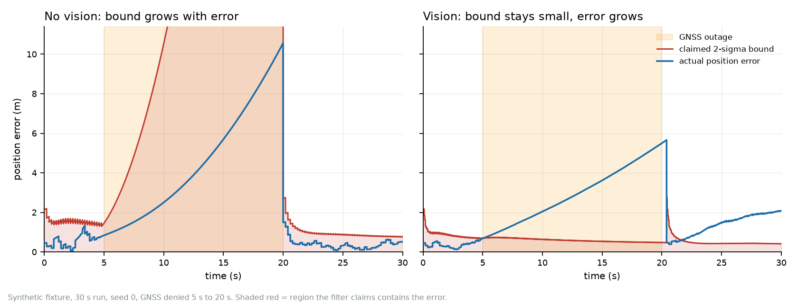

# contested-nav

**Is the filter right about how wrong it is?**

`contested-nav` is a 21-state error-state Kalman filter and an evaluation harness for GNSS-denied
navigation. It measures not only how accurate the trajectory is, but whether the uncertainty the
filter reports is honest.

| Configuration | ATE RMSE | Claimed 1σ | Mean NEES (expected 3) | 2σ-per-axis coverage (expected 99.3%) |
|---|---:|---:|---:|---:|
| GNSS denied, vision off | 3.783 m | 0.567 m | 4.1 | 100.0% |
| GNSS denied, vision on | **2.506 m** | **0.161 m** | **391.2** | **20.0%** |

**Accuracy improved. Calibration failed.** The filter converges and is confidently wrong, so visual
fusion ships off by default. The overconfidence held in every run of every sweep; the accuracy gain
did not (see [Results](results.md)).

!!! warning "Synthetic evidence only"
    Every number comes from a deterministic known-answer fixture. No real sensor capture is
    evaluated and no number here is a field measurement.

## Where to start

- [Getting started](getting-started.md): install, run the headline case in 19 seconds, reproduce every number.
- [Concepts](concepts.md): why this is not a tuning problem, what is in the filter, how calibration is measured.
- [Results](results.md): the seven scenarios, the sweeps and what they do and do not show.
- [Model and interface contract](MODEL.md): units, frames, every configuration key, the result format and a fault-mode table.
- [Scope and responsible use](scope.md) and [Status and limits](status.md).
