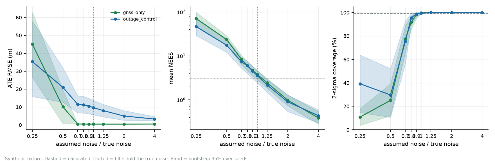

# Noise mismatch

What happens when the filter is told the wrong sensor noise.

Every calibrated result elsewhere in this site has the filter told the true noise of the
sensors that made the data. That is the easiest case a Kalman filter can have, and a real
filter never gets it. This page generates the data once with the true noise and filters it
with the assumed GNSS and vision sigmas multiplied by a factor. A factor below 1 makes the
filter trust the sensor more than it should; above 1, less. ([Model contract](MODEL.md),
as-implemented finding 5.)

```bash
navkit sweep mismatch --csv docs/data/mismatch_sweep.csv \
    --figure docs/figures/mismatch-sweep.png --page docs/mismatch.md
```

Two cases, nine factors, five noise seeds each. `gnss_only` has GNSS and no outage;
`outage_control` has the 15 s GNSS outage with vision off. The table below is generated from
[`data/mismatch_sweep.csv`](data/mismatch_sweep.csv) and a test fails if they disagree. CI
reruns the sweep and fails if the committed CSV no longer matches it.

<!-- mismatch:start -->

| Case | Assumed noise x | ATE rmse m [95% CI] | NEES mean [95% CI] | Coverage @2σ % [95% CI] | Claimed 1σ m | GNSS fixes rejected % [95% CI] | Verdicts |
|---|---:|---|---|---|---:|---|---|
| gnss_only | 0.25 | 45.03 [26.46, 62.92] | 72.3 [48.1, 100.8] | 10.8 [3.7, 18.0] | 7.198 | 94.4 [92.1, 96.8] | overconfident x5 |
| gnss_only | 0.5 | 10.07 [0.70, 19.57] | 24.3 [18.8, 29.3] | 23.5 [11.0, 37.0] | 2.251 | 47.8 [22.8, 75.0] | overconfident x5 |
| gnss_only | 0.7 | 0.57 [0.53, 0.61] | 8.4 [6.4, 10.4] | 76.5 [61.3, 89.7] | 0.187 | 4.2 [3.7, 4.9] | overconfident x5 |
| gnss_only | 0.8 | 0.52 [0.49, 0.57] | 5.9 [4.5, 7.3] | 92.0 [86.3, 97.1] | 0.207 | 1.2 [0.9, 1.3] | mixed(bulk xoverconfident, tail xunderconfident) x1, overconfident x4 |
| gnss_only | 0.9 | 0.51 [0.47, 0.56] | 4.6 [3.4, 5.8] | 98.8 [96.7, 100.0] | 0.228 | 0.1 [0.0, 0.4] | mixed(bulk xoverconfident, tail xcalibrated) x1, mixed(bulk xoverconfident, tail xunderconfident) x2, overconfident x1, underconfident x1 |
| gnss_only | 1 | 0.51 [0.46, 0.55] | 3.7 [2.7, 4.6] | 99.9 [99.6, 100.0] | 0.252 | 0.0 [0.0, 0.0] | mixed(bulk xoverconfident, tail xcalibrated) x1, mixed(bulk xoverconfident, tail xunderconfident) x2, underconfident x2 |
| gnss_only | 1.25 | 0.50 [0.46, 0.54] | 2.3 [1.7, 3.0] | 100.0 [100.0, 100.0] | 0.312 | 0.0 [0.0, 0.0] | mixed(bulk xoverconfident, tail xunderconfident) x1, underconfident x4 |
| gnss_only | 2 | 0.49 [0.44, 0.54] | 0.9 [0.7, 1.2] | 100.0 [100.0, 100.0] | 0.489 | 0.0 [0.0, 0.0] | underconfident x5 |
| gnss_only | 4 | 0.54 [0.48, 0.60] | 0.4 [0.3, 0.5] | 100.0 [100.0, 100.0] | 0.920 | 0.0 [0.0, 0.0] | underconfident x5 |
| outage_control | 0.25 | 35.37 [15.85, 58.09] | 48.6 [30.5, 68.6] | 39.3 [14.6, 63.8] | 6.940 | 87.9 [82.1, 93.7] | overconfident x5 |
| outage_control | 0.5 | 21.02 [12.66, 31.96] | 17.8 [12.7, 24.5] | 29.4 [10.6, 51.7] | 2.669 | 43.4 [20.5, 67.9] | overconfident x5 |
| outage_control | 0.7 | 11.53 [6.77, 16.29] | 7.4 [5.3, 9.4] | 74.3 [54.4, 92.5] | 0.420 | 3.4 [1.6, 5.3] | overconfident x5 |
| outage_control | 0.8 | 11.32 [6.69, 15.95] | 6.0 [4.0, 7.7] | 94.9 [88.1, 98.9] | 0.463 | 0.8 [0.0, 1.8] | mixed(bulk xunderconfident, tail xcalibrated) x1, overconfident x4 |
| outage_control | 0.9 | 10.54 [6.20, 14.88] | 4.6 [3.1, 5.9] | 98.7 [96.0, 100.0] | 0.512 | 0.0 [0.0, 0.0] | mixed(bulk xoverconfident, tail xunderconfident) x3, overconfident x1, underconfident x1 |
| outage_control | 1 | 9.72 [5.65, 13.80] | 3.6 [2.5, 4.6] | 99.5 [98.4, 100.0] | 0.567 | 0.0 [0.0, 0.0] | mixed(bulk xoverconfident, tail xunderconfident) x3, overconfident x1, underconfident x1 |
| outage_control | 1.25 | 8.02 [4.51, 11.53] | 2.2 [1.5, 2.9] | 100.0 [100.0, 100.0] | 0.703 | 0.0 [0.0, 0.0] | mixed(bulk xoverconfident, tail xunderconfident) x1, underconfident x4 |
| outage_control | 2 | 5.02 [2.63, 8.03] | 0.9 [0.5, 1.3] | 100.0 [100.0, 100.0] | 0.944 | 0.0 [0.0, 0.0] | underconfident x5 |
| outage_control | 4 | 3.34 [2.38, 4.75] | 0.4 [0.3, 0.6] | 100.0 [100.0, 100.0] | 1.713 | 0.0 [0.0, 0.0] | underconfident x5 |

<!-- mismatch:end -->



## What it shows

Each statement below is checked against the CSV by `tests/test_mismatch_sweep.py`.

1. **An optimistic noise model is not a graceful failure.** With the assumed noise below the
   true noise, the chi-square gate starts rejecting healthy GNSS fixes (see the rejection
   column), the filter dead-reckons through the gap, and error grows. In `gnss_only` it grows by
   more than an order of magnitude at the strongest mismatch; in `outage_control`, which starts
   from a large error, it still more than doubles. The gate meant to protect the filter from bad data turns an
   optimistic noise model into data loss. I checked this mechanism on one run (seed 0, factor
   0.5, `gnss_only`): 116 of 151 fixes were rejected and one fault was declared. That one run is
   an observation, not part of the table.
2. **Calibration is lost well before the gate does much damage.** Mean 2σ coverage leaves a
   90% band between factors 0.7 and 0.8 in both cases, while the rejection share is still in
   single digits. An underestimate of the sensor noise of between 20% and 30% is enough. The
   90% band is my choice, not a derived threshold.
3. **A pessimistic noise model is benign for accuracy and honest about it.** With the assumed
   noise above the true noise, the position error in `gnss_only` barely moves, the claimed
   uncertainty scales up with the assumption, coverage stays at 100% and the filter reads as
   underconfident. Looser, not wrong.
4. **With the true noise, the bulk test already reads slightly overconfident.** At factor 1
   the mean NEES is above 3 in both cases, although its interval includes 3, which matches the
   benchmark's `mixed` verdicts. By factor 1.25 the mean NEES is below 3.
5. **One result I did not expect and have not explained.** In `outage_control`, position error
   falls as the assumed noise grows, and the intervals at factors 1 and 4 do not overlap. A
   plausible reason is that a larger assumed noise keeps the bias states from fitting GNSS
   noise before the outage, which would make dead reckoning through it better. That is a
   hypothesis; I did not test it.

## What this does not show

- One synthetic path, one noise model (white and Gaussian), and one factor applied to every
  axis and, with `--channel both`, to both sensors. Nothing here says how a real receiver's
  noise is mismatched.
- Only the assumed GNSS and vision sigmas change. IMU noise, the outage window and the
  trajectory do not.
- `gnss_only` runs with a noiseless IMU and `outage_control` with the default IMU noise, because the
  benchmark runner skips the injection layer for a case with no outage
  ([issue 56](https://github.com/Telschow/contested-nav/issues/56)). The two cases differ in more than the
  outage, and the `gnss_only` rows are for a filter with no IMU noise to contend with. The sweep has not
  been re-run with the layer forced on.
- Five seeds per cell, so the intervals are rough. At factor 1 the per-seed verdicts are split
  between `mixed`, `underconfident` and `overconfident`; the verdict column shows the split
  rather than a single label.
- It does not say what the right noise is, or how to estimate it. Adaptive noise estimation is
  not implemented.
