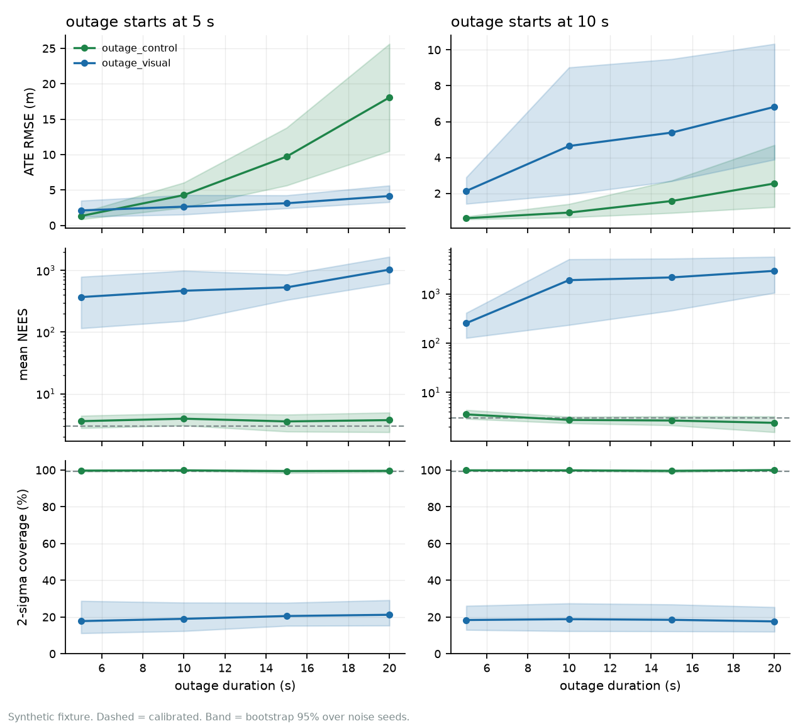

# Status and limits

- **Not field validated.** Synthetic fixture only. No real capture is vendored
  or evaluated, and no number is a field measurement.
- **Visual aiding under GNSS denial is untrustworthy**, and disabled by default.
  See [concepts](concepts.md#the-one-thing-this-cannot-do).
- **FDIR detects implausible updates; it does not yet explain them.** The
  chi-square gate in `fdir/` isolates a channel and says how long it was out,
  but it does not separate multipath from spoofing from sensor degradation. See
  [ADR-0005](adr/0005-chi-square-fdir-gating.md).
- **The calibrated-covariance failure is mitigated, not fixed.** The ADR-0005
  gate assumed a calibrated innovation covariance the filter does not have once
  position covariance has collapsed, and in `outage_visual` that cost 1.6 m of
  ATE. That was blocker B5, closed by
  [ADR-0006](adr/0006-nis-window-monitor.md): a per-channel NIS window plus
  adaptive GNSS covariance inflation, which re-gates a returning fix once
  under an inflated covariance. ATE 5.059 m to 2.541 m and rejections 51 to 5,
  with the false-alarm rate unchanged. B1 is still open, see below.
- **The filter is still overconfident under visual aiding.** Mean NEES 419.4
  against a nominal 3, 2σ coverage 20.0% where the SRS requires 95% (AC-04) and the roadmap
  gate for turning vision on is above 90%. It converges and
  is confidently wrong. This is blocker B1, and it is a pose-graph problem that
  no threshold in the FDIR subsystem will move. Robust across 10 noise seeds
  (worst case NEES 211.7, 6.8% coverage) and across all 8 scenes
  (419.7 [414.4, 424.9], 20.0%).

- **ADR-0008 frozen-anchor cross-check: implemented but unreachable under the
  current state-transition logic; the security gap remains documented as open.**
- **The published numbers are single draws.** A 10-seed sweep shows NEES varying
  by 4.4x to 45x between cases, and the two controls the tables call calibrated
  (`gnss_only`, `outage_control`) flip verdict across seeds, and `outage_control` is
  never clean in 10 draws. The shipped tables remain the seed-0 benchmark, which
  is the committed artefact; treat the magnitudes as order-of-magnitude and the
  verdicts as the claim.
- **Scene generalisation is demonstrated, external validity is not.** The
  8-scene sweep varies trajectory geometry over a 4.65x path-length range and all
  seven verdicts hold, so the failure above is not a property of one path. What is
  *not* shown: any real capture, any measured sensor characteristic, or any scene
  outside an analytic trajectory generator. Eight synthetic scenes bound the
  claim "the anchor model is structurally wrong under visual aiding"; they do not
  bound its behaviour on real imagery. Scenario duration remains fixed at 30 s.
- **The outage window matters for accuracy, not for calibration.** The outage
  sweep (`navkit sweep outages`, 8 windows, 5 seeds each, one synthetic path)
  gives `outage_visual` a 2-sigma coverage of 10.4% to 39.2% and a mean NEES of
  61.5 to 10 322 in **all 40 runs**, including 5 s outages; `outage_control`
  stays at 97.3% to 100.0% coverage in all 40. Accuracy is different. With the
  outage starting at 5 s, vision beats the control in all 5 seeds for 10 s, 15 s
  and 20 s outages (ATE ratio 0.14 to 0.96) and in 2 of 5 for 5 s. With the outage
  starting at 10 s, vision is **worse** than the control in all 20 runs (ATE
  ratio 1.26 to 7.11). The cause is not tested here. So "vision improves ATE"
  is a property of the benchmark's early outage, not a general result.

  
- **Not flight-ready.** No sensor driver, no live front end, no real-time loop,
  no failure-mode handling beyond a measurement gate.
- **TUM VI regression is partial.** The trajectory reader is validated against
  the published room1/512/16 ATE, but the full mocap ground truth is not
  vendored, so that check is skipped when the data is absent.
